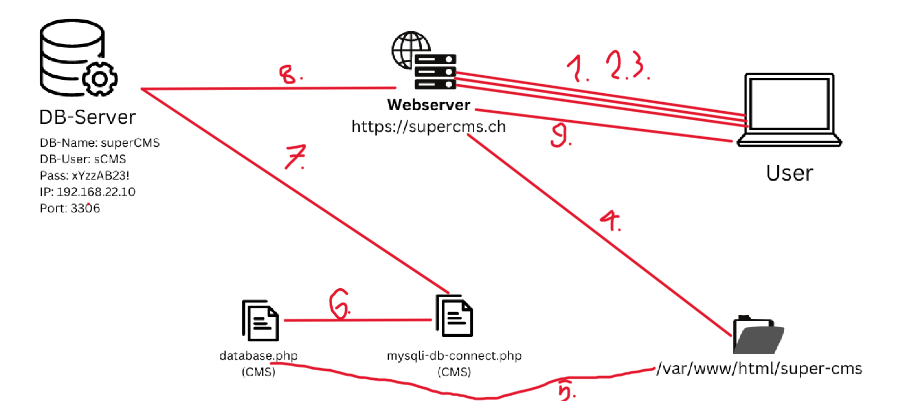

# Übung HTTPS ablauf
1. User setzt anfrage zum Webserver
2. TCP Verbindung Port 443
3. TLS-Handshake + Cerifikat
4. Verschlüsselung aufbauen
5. Browser sendet HTTPS request
6. Webserver lädt CMS Datei
7. CMS verbindet sich mit der DB
8. DB liefert Daten
9. Webserver sendet daten an User

## Aufgabe 3.
HTTPS: User <--> Webserver
mysqli: Webserver <--> DB-server
ext4: /var/www/html/super-cms