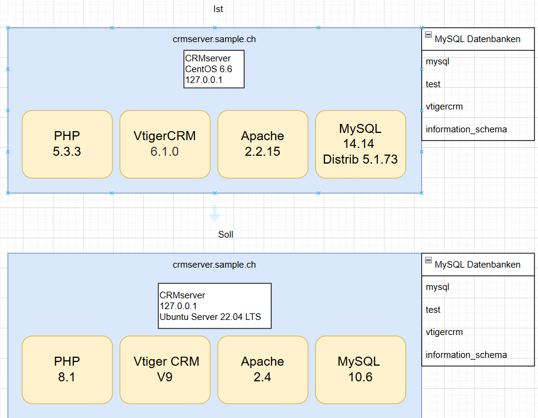
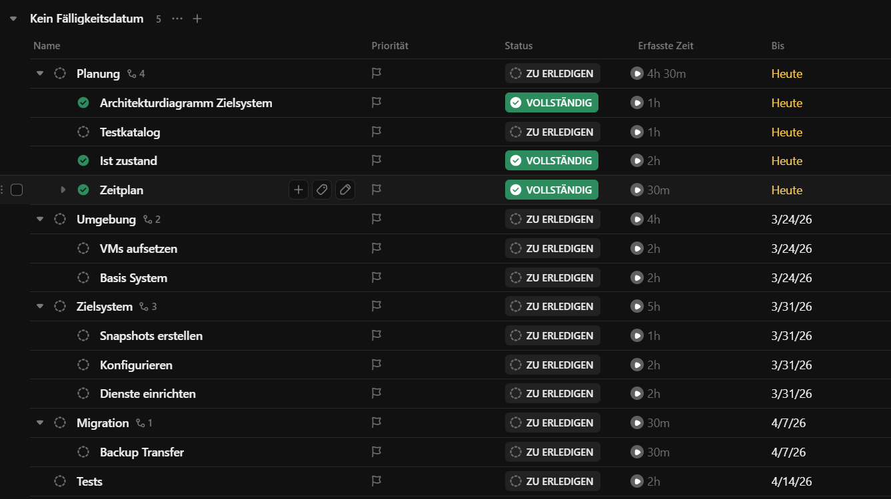

# Planung
## Projektplan
Im Rahmen dieses Projekts wird das bestehende Vtiger CRM-System, das aktuell auf einem CentOS 6.6 Server mit MySQL-Datenbank betrieben wird, auf eine moderne und unterstützte Systemumgebung migriert.

**Ist**
* System: Vtiger CRM
* Betriebssystem: CentOS 6.6
```
[root@crmserver ~]# cat /etc/redhat-release
CentOS release 6.6 (Final)
```
* Datenbank: MySQL 14.14 Distrib 5.1.73
```
[root@crmserver ~]# sudo mysql --version
mysql  Ver 14.14 Distrib 5.1.73, for redhat-linux-gnu (x86_64) using readline 5.1
```
* Webserver: Apache/2.2.15 (Unix)
```
[root@crmserver ~]# sudo httpd -v
Server version: Apache/2.2.15 (Unix)
Server built:   Oct 16 2014 14:48:21
```
* Server: crmserver.sample.ch
* System läuft on-prem als VM
* CentOS 6.6 ist veraltet / nicht mehr unterstützt


**Soll**
* System: Vtiger CRM V9
* Betriebssystem: Ubuntu Server 22.04 LTS
* Datenbank: MySQL 10.6
* Webserver: Apache 2.4
**Diagramm**



**MySQL**:
Bestehende Datenbanken:<br>
* mysql
* test
* vtigercrm
* information_schema
```
mysql> SHOW DATABASES;
+--------------------+
| Database           |
+--------------------+
| information_schema |
| mysql              |
| test               |
| vtigercrm          |
+--------------------+
```

Bestehende User:
vtigercrm: 
```
mysql> SELECT user_name, user_password, email1 FROM vtiger_users;

+-----------+------------------------------------+--------------------+
| user_name | user_password                      | email1             |
+-----------+------------------------------------+--------------------+
| admin     | $1$ad000000$r3hzdtsdvtvXX9nD2w4yb0 | hans@sample.com    |
| sepp      | $1$se000000$KRn9kiYxE/S641n24kfbA/ | sepp@sample.com    |
| chantal   | $1$ch000000$9NT/kT3TKqF3tDE0w.YTz1 | chantal@sample.com |
+-----------+------------------------------------+--------------------+
```

### Zeitplan


## Vtiger


Da das passwort nicht bekannt ist habe ich dies zurückgesetzt.
