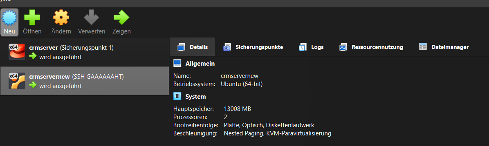
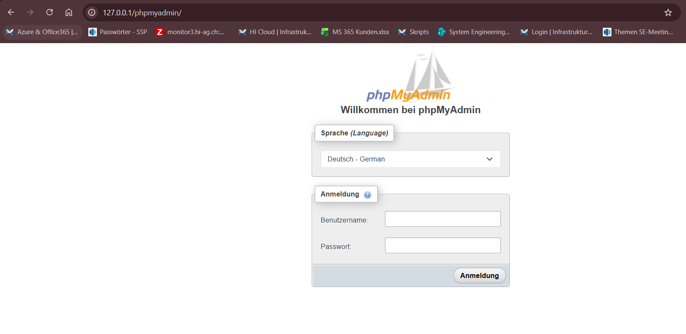

# Umgebung

## Ubuntu VM installieren

Musste die installation mehrfach neu starten. Fehler konnte ich nicht bestimmen.

## SSH Einrichten
Befehl: ssh admin@127.0.0.1 -p 2223

OpenSSH installieren:
```
sudo apt install openssh-server
sudo systemctl start ssh
sudo systemctl status ssh
```
## DNS einrichten
1. Hostname anpassen: crmservernew --> crm-soll.sample.ch
```
sudo hostenamectl set-hostname crm-soll.sample.ch
```
2. Hosts file anpassen
```
  GNU nano 7.2                                                                hosts
127.0.0.1       localhost
127.0.1.1       crm-soll.sample.ch crm-soll
10.0.2.15       crm-soll.sample.ch

# The following lines are desirable for IPv6 capable hosts
::1             ip6-localhost ip6-loopback
fe00::0         ip6-localnet
ff00::0         ip6-mcastprefix
ff02::1         ip6-allnodes
ff02::2         ip6-allrouters
```

## Webserver
1. Apache installieren
```
sudo apt install apache2
```
2. version kontrollieren
```
admin@crmservernew:~$ apache2 -v
Server version: Apache/2.4.58 (Ubuntu)
Server built:   2026-03-05T17:31:54
```
3. VirtualHost
Conf datei erstellen.
```
sudo nano /etc/apache2/sites-available/meine-seite.conf
```
4. Config einfügen.
```
<VirtualHost *:80>
    ServerName 127.0.0.1
    UseCanonicalName Off
    DocumentRoot /var/www/html/vtigercrm
<Directory /var/www/html/vtigercrm>
        Options FollowSymLinks
        AllowOverride All
        Require all granted
</Directory>
    ErrorLog ${APACHE_LOG_DIR}/error.log
    CustomLog ${APACHE_LOG_DIR}/access.log combined
</VirtualHost>
```

## PHP
1. Update
```
sudo apt update
```
2. installieren
```
sudo apt install php libapache2-mod-php php-mysql
```
3. Versionskontrolle
```
admin@crmservernew:/etc/apache2/sites-available$ php -v
PHP 8.3.6 (cli) (built: Mar 20 2026 02:32:55) (NTS)
Copyright (c) The PHP Group
Zend Engine v4.3.6, Copyright (c) Zend Technologies
    with Zend OPcache v8.3.6, Copyright (c), by Zend Technologies
```
## MariaDB

1. update
```
sudo apt update
```
2. Installieren
```
sudo apt install mariadb-server
```
3. version kontrollieren
```
admin@crmservernew:/var/www/html$ sudo mariadb -v
Welcome to the MariaDB monitor.  Commands end with ; or \g.
Your MariaDB connection id is 32
Server version: 10.11.14-MariaDB-0ubuntu0.24.04.1 Ubuntu 24.04
```
4. Absichern
```
sudo mysql_secure_installation
```
5. Login testen
```
sudo mysql -u root -p
```

## PHPmyadmin
1. update
```
sudo apt update
```
2. Installieren
```
sudo apt install phpmyadmin
```
Alle Fragen mit ja beantworten und pw setzen
3. Apache Konfiguration verlinken
```
sudo ln -s /etc/phpmyadmin/apache.conf /etc/apache2/conf-available/phpmyadmin.conf
sudo a2enconf phpmyadmin
sudo systemctl reload apache2
```
4. Testen

