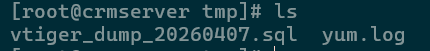
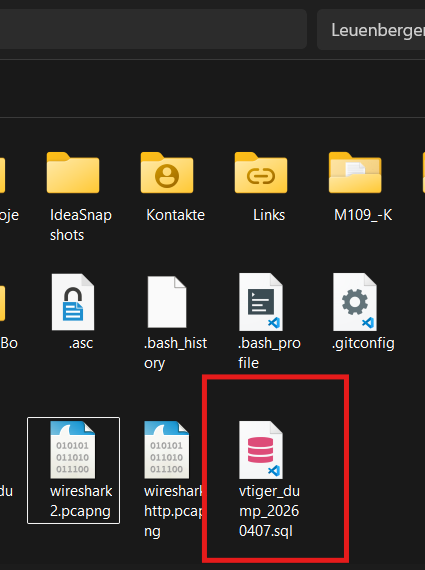
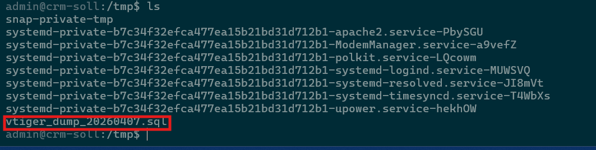
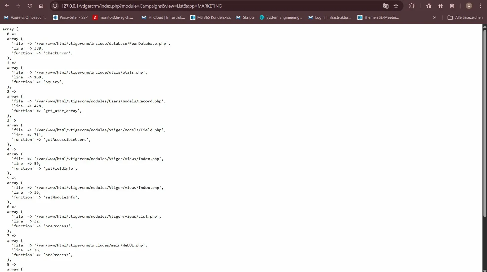
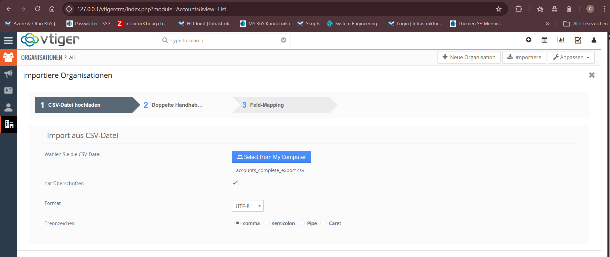
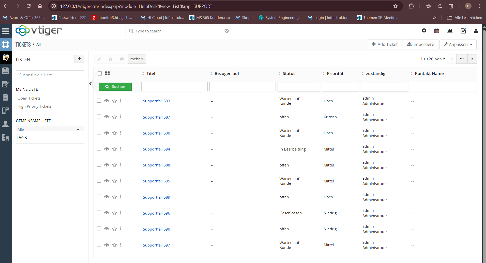

# Migration
Die Migration habe ich von Hand gemacht.

1. Vorbereitung
Snapshot vom neuen system, vor dem Import erstellt, falls der import fehlerhaft sein sollte.

2. Export vom alten System
die daten aus der alten MySQL datenbank exportiert.
```
mysqldump -u root -p123456 vtigercrm > /tmp/vtiger_dump_20260407.sql
```


3. Über Windows Host transportieren
Die Datei wird über den Windows host transportiert da es nicht direkt gieng.
```
scp -P 2222 -o HostKeyAlgorithms=+ssh-rsa -o PubkeyAcceptedAlgorithms=+ssh-rsa root@127.0.0.1:/tmp/vtiger_dump_20260407.sql C:\Users\cleue
```


4. Auf neue Maschiene schieben
```
PS C:\Users\cleue> scp -P 2223 vtiger_dump_20260407.sql admin@127.0.0.1:/tmp/
```


5. Daten Analysieren
Dieser schritt war wichtig um zu sehen was migriert werden muss und wass anschliesend wieder vorhanden sein muss.
```
mysql -u root -p123456 vtigercrm -e "SELECT table_name, table_rows FROM information_schema.tables WHERE table_schema='vtigercrm' AND table_rows > 50 ORDER BY table_rows DESC;"
```
+------------------------------------+------------+
| table_name                         | table_rows |
+------------------------------------+------------+
| vtiger_profile2field               |       2668 |
| vtiger_crmentity                   |       2497 |
| vtiger_role2picklist               |       1752 |
| vtiger_accountbillads              |        814 |
| vtiger_field                       |        773 |
| vtiger_potential                   |        727 |
| vtiger_accountscf                  |        677 |
| vtiger_def_org_field               |        658 |
| vtiger_account                     |        655 |
| vtiger_accountshipads              |        601 |
| vtiger_potentialscf                |        600 |
| vtiger_ticketcf                    |        597 |
| vtiger_troubletickets              |        559 |
| vtiger_profile2standardpermissions |        469 |
| vtiger_contactdetails              |        403 |
| vtiger_contactaddress              |        379 |
| vtiger_contactsubdetails           |        379 |
| vtiger_contactscf                  |        379 |
| vtiger_customerdetails             |        379 |
| vtiger_profile2utility             |        224 |
| vtiger_cvcolumnlist                |        177 |
| vtiger_profile2tab                 |        172 |
| vtiger_selectcolumn                |        154 |
| vtiger_currencies                  |        137 |
| vtiger_relatedlists                |        133 |
| vtiger_blocks                      |        119 |
| vtiger_org_share_action2tab        |        100 |
| vtiger_time_zone                   |         96 |
| vtiger_links                       |         72 |
| vtiger_parenttabrel                |         65 |
| vtiger_ws_operation_parameters     |         56 |
+------------------------------------+------------+
6. Export auf dem Quellsystem
Der Import per mysql dump hat zu einigen Problemen geführt.
Desswegen habe ich entschieden den Import mit dem Vtiger eigenem impost tool durchzuführen.
Fehler:

```
mysql -u root -p123456 --default-character-set=utf8 vtigercrm -e \
  "SELECT a.accountname, a.phone, a.email1, a.website,
          b.bill_street, b.bill_city, b.bill_code, b.bill_country,
          s.ship_street, s.ship_city, s.ship_code, s.ship_country
   FROM vtiger_account a
   LEFT JOIN vtiger_accountbillads b ON a.accountid = b.accountaddressid
   LEFT JOIN vtiger_accountshipads s ON a.accountid = s.accountaddressid;" \
  | sed 's/\t/,/g' > /tmp/accounts_complete_export.csv

# Support-Tickets:
mysql -u root -p123456 vtigercrm -e \
  "SELECT title, status, priority FROM vtiger_troubletickets;" \
  | sed 's/\t/,/g' > /tmp/tickets_export.csv

# Verkaufschancen:
mysql -u root -p123456 vtigercrm -e \
  "SELECT potentialname, amount, currency, closingdate FROM vtiger_potential;" \
  | sed 's/\t/,/g' > /tmp/potentials_export.csv

# Kontakte:
mysql -u root -p123456 vtigercrm -e \
  "SELECT lastname FROM vtiger_contactdetails;" \
  | sed 's/\t/,/g' > /tmp/contacts_export.csv
```


7. Import per Vtiger
Die Migration erfolgte per vtiger in der hoffnung keine fehler durch das ständige verschieben zu generieren.
Accounts:

Tickets:

