# Testcases CRM Migration

## Testing

1. **Lokale DNS-Auflösung**  
   Befehl: `ping crmserver.sample.ch`  
    Erwartet: Antwort von 10.0.2.15  
    Ergebniss: Erfolgreich 
    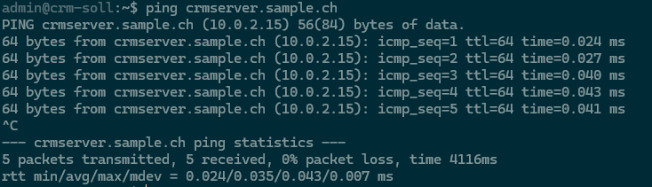
2. **Zweite Domain**  
   Befehl: `ping crm-soll.sample.ch`  
   Erwartet: Antwort von 10.0.2.15  
   Ergebniss: Erfolgreich 
   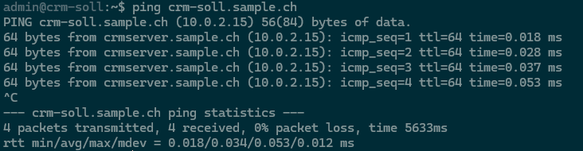

3. **DNS extern**  
   Befehl: `nslookup crmserver.sample.ch`  
   Erwartet: Domain wird auf 10.0.2.15 aufgelöst
   Ergebniss: Erfolgreich 
   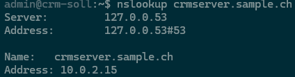

4. **Webserver HTTP**  
   Befehl: `curl -I http://crmserver.sample.ch`  
   Erwartet: HTTP 200 / 301 / 302 
   Ergebniss: Erfolgreich 
   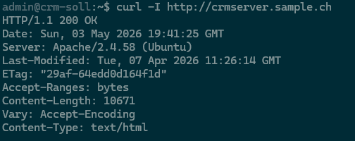

5. **Webserver HTTPS**  
   Befehl: `curl -I https://crmserver.sample.ch`  
   Erwartet: Erwarteter Fehler, da HTTPS nicht konfiguriert ist
   Ergebniss: Fehlschlag 
   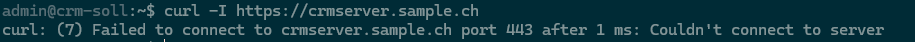

6. **Website erreichbar**  
   URL: http://127.0.0.1/vtigercrm/index.php 
   Erwartet: Erreichbar 
   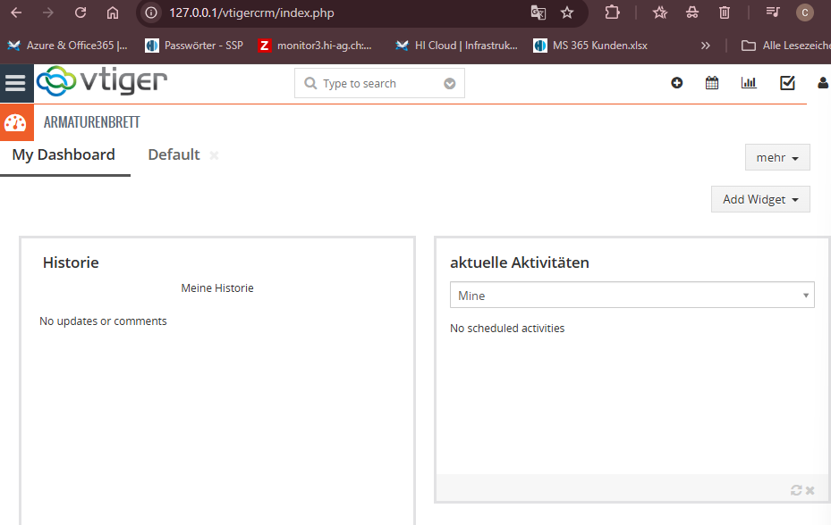

7. **PHP Version**  
   Befehl: `php -v`  
   Erwartet: version 8.3.6
   Ergebniss: Version 8.3.6 
   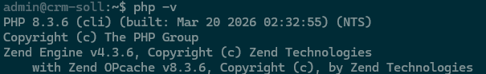

8. **PHP Module**  
   Befehl: `php -m`  
   Erwartet: mysqli, curl vorhanden  
   Ergebniss: Vorhanden 
   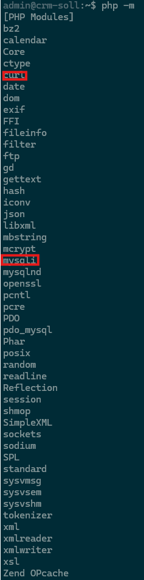

9. **DB läuft**  
   Befehl: `systemctl status mariadb`  
   Erwartet: active (running)  
   Ergebniss: Läuft 
   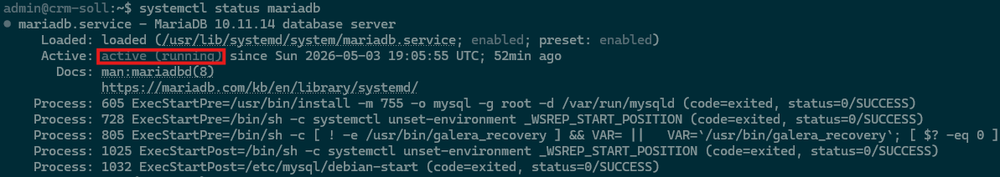

10. **DB Login**  
    Befehl: `mysql -u root -p`  
    Erwartet: Login erfolgreich  
    Ergebniss: Erfolgreich 
    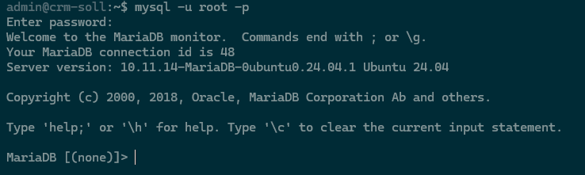
11. **Tabellenanzahl**  
    SQL: `SELECT COUNT(*) FROM information_schema.tables WHERE table_schema='vtiger';`  
    Erwartet: gleiche Anzahl wie vorher  
    
    Ergebnis Datenvergleich
    | System        | Datenbank | Anzahl Tabellen |
    |--------------|----------|-----------------|
    | Zielsystem (neu) | vtiger     | 527             |
    | Altsystem (alt)  | vtigercrm  | 491             |
    (Tabelle wurde mit ChatGPT erstellt Inhalt ist jedoch original)

    Das Zielsystem enthält mehr Tabellen als das Altsystem.

    Erklärung des unteschieds:
    - das Zielsystem hat neuere Version von Vtiger
    - bei der Installation zusätzliche System- und Modul-Tabellen erstellt werden
    - die Migration über den Vtiger-Import durchgeführt wurde und nicht über einen vollständigen Datenbank-Dump

    Das bedeutet:
    - die Struktur (Tabellen) ist nicht identisch → das ist **erwartet**
    - entscheidend ist, dass die wichtigen Geschäftsdaten korrekt übernommen wurden

12. **Wichtige CRM-Daten vergleichen**  
    SQL: `SELECT COUNT(*) FROM vtiger_account;`  
    SQL: `SELECT COUNT(*) FROM vtiger_contactdetails;`  
    SQL: `SELECT COUNT(*) FROM vtiger_potential;`  
    Erwartet: Die wichtigsten Geschäftsdaten sind auf altem und neuem System gleich vorhanden.  
    Ergebnis: Stimmen überein (Account, Kontakte, Potential)
    | Tabelle | Altsystem | Zielsystem |
    |---|---:|---:|
    | vtiger_account | 703 | 703 |
    | vtiger_contactdetails | 379 | 379 |
    | vtiger_potential | 600 | 600 ||

  

13. **CRM Login**  
    Vorgehen: Login im Browser  
    Erwartet: Dashboard sichtbar  
    Ergebnis: Login geht 
    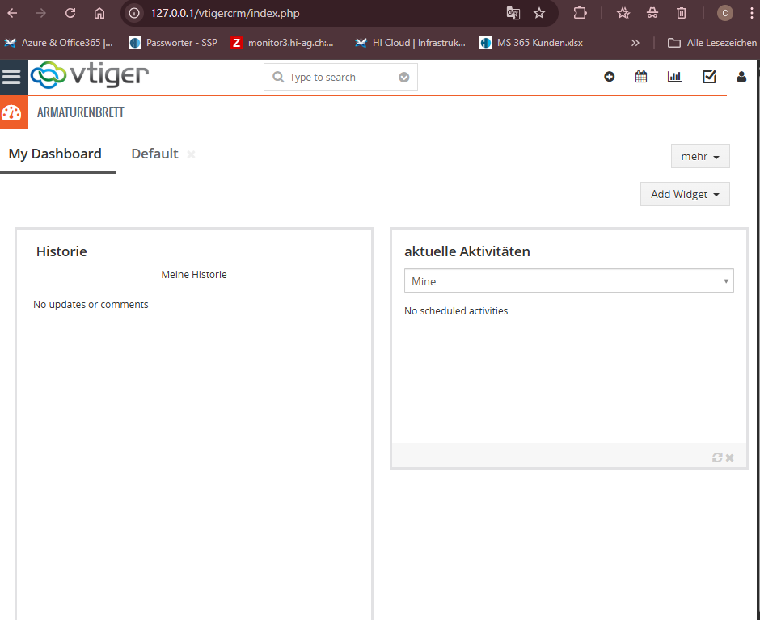

14. **Daten anzeigen**  
    Vorgehen: Personen öffnen  
    Erwartet: Daten korrekt sichtbar  
    Ergebnis: Erfolgreich 
    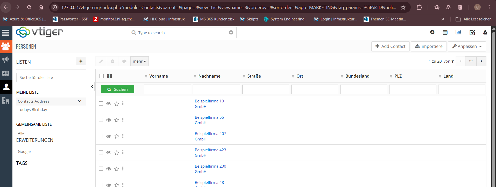

15. **Datensatz erstellen**  
    Vorgehen: neuen Kontakt erstellen  
    Erwartet: gespeichert  
    Ergebnis: Erfolgreich 
    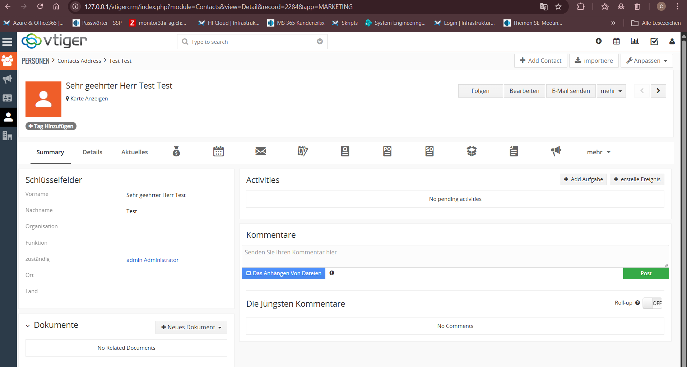

16. **Datensatz bearbeiten**  
    Vorgehen: Kontakt ändern  
    Erwartet: Änderung gespeichert  
    Ergebnis: Erfolgreich 
    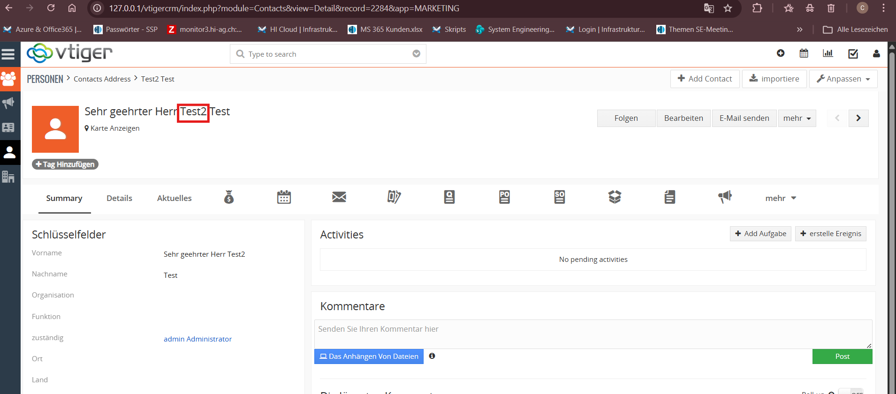

17. **SFTP Zugriff**  
    Befehl: `sftp user@crmserver.sample.ch`  
    Erwartet: Login möglich  
    Ergebnis: Erfolgreich 
    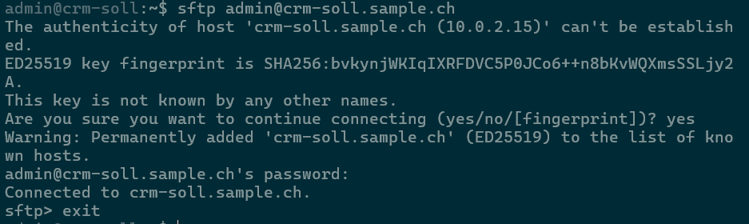

18. **Backup erstellen**  
    Befehl: `mysqldump -u user -p db > backup.sql`  
    Erwartet: Datei erstellt  
    Ergebnis: Datei erstellt 
    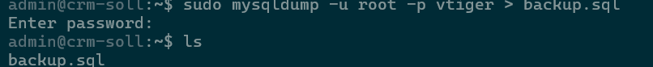

19. **Backup Restore**  
    Befehl: `mysql -u user -p testdb < backup.sql`  
    Erwartet: Import erfolgreich  
    Ergebnis: Erfolgreich 
    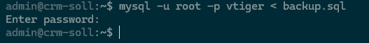

20. **DB Zugriffsschutz**  
    Befehl: `mysql -u falscherUser -p`  
    Erwartet: Access denied  
    Ergebnis: Erfolgreich 
    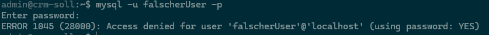

**Hinweis:** Tests wurden aufgrund von zeitmangel mit ChatGPT erstellt.
Prompt: 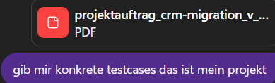